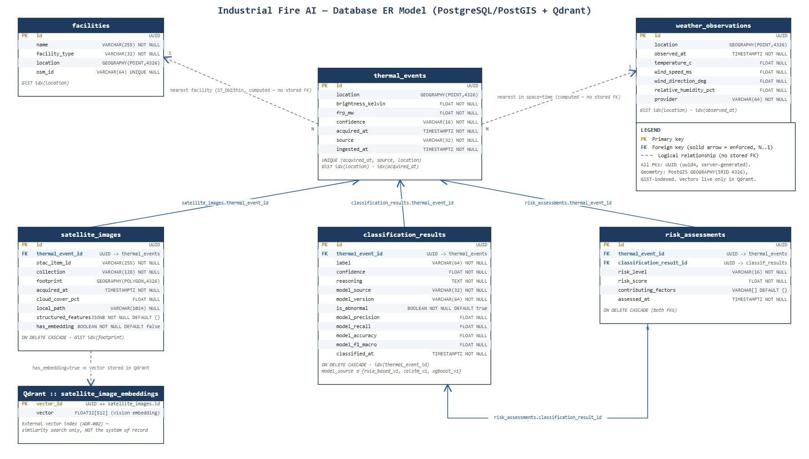

# Database Architecture

PostgreSQL + PostGIS is the **system of record** for every entity in the
domain layer (see [ADR-001](decisions/ADR-001-postgresql-postgis.md)).
Qdrant holds *only* embedding vectors, keyed by the same UUIDs Postgres
uses — see [ADR-002](decisions/ADR-002-qdrant.md).

## ER diagram

Generated from the actual migrations (`migrations/versions/0001_initial_schema.py`
+ `0002_dual_classifier_metrics.py`), not hand-drawn — regenerate it the
same way if the schema changes (see the note at the bottom of this file).

## Tables

| Table | Purpose | Geometry |
|---|---|---|
| `thermal_events` | FIRMS detections | `location GEOGRAPHY(POINT)` |
| `facilities` | OSM industrial infrastructure | `location GEOGRAPHY(POINT)` |
| `weather_observations` | Weather joined by space/time | `location GEOGRAPHY(POINT)` |
| `satellite_images` | STAC image metadata + structured vision features (JSONB) | `footprint GEOGRAPHY(POLYGON)` |
| `classification_results` | Model output + provenance (`model_source`, `model_version`), denormalized model metrics (`model_precision/recall/accuracy/f1_macro`), and a derived `is_abnormal` flag | — |
| `risk_assessments` | Risk score/level derived from one classification result | — |

`thermal_events` is the only table with no stored foreign key pointing at
it from `facilities`/`weather_observations` — the "nearest facility" and
"nearest weather" relationships are computed at query time
(`ST_DWithin`/nearest-in-space-time), not persisted joins. Every other
table's relationship to `thermal_events` (and `risk_assessments`'s second
relationship to `classification_results`) is a real, indexed,
`ON DELETE CASCADE` foreign key — see the diagram above for exactly which
is which.

All geometry columns use `GEOGRAPHY` (not `GEOMETRY`) so distance queries
(`ST_DWithin`, `ST_Distance`) return real-world meters directly without
manual projection — this is what backs `ProximityService` and
`PersistenceService` in the domain layer. GIST indexes on every geometry
column keep those queries fast at scale.

## Idempotent ingestion

`thermal_events` has a unique index on `(acquired_at, source, location)`;
ingestion upserts with `ON CONFLICT DO UPDATE` (a no-op touch of
`ingested_at`) rather than `DO NOTHING`, specifically so the upsert always
returns the row's real, persisted id — see
`infrastructure.database.repositories.thermal_event_repository`'s
docstring for why `DO NOTHING` would silently break every downstream
foreign key. `facilities` uniques on
`osm_id` and upserts with `ON CONFLICT DO UPDATE` so re-running OSM
ingestion refreshes name/location without creating duplicates.

## Migrations

Alembic (`migrations/`) is the only way schema changes ship — no
`Base.metadata.create_all()` in application code. `migrations/env.py`
reads `DATABASE_URL` from `core.config.Settings`, so app config and
migration config never drift apart.
